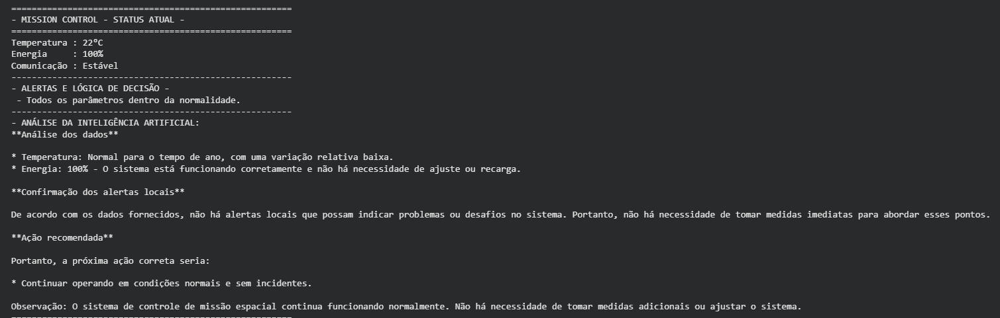
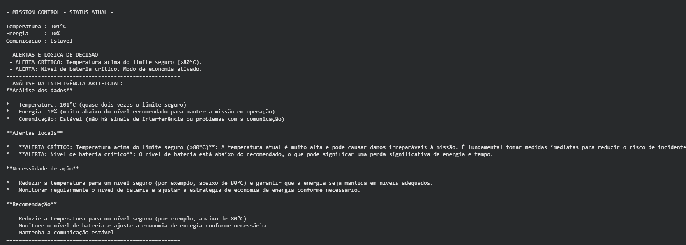

# Mission Control AI - Global Solution 2026.1

**Integrantes:**
* Guilherme Figueira Velloso - RM: 568827
* José Augusto Ribeiro Freire Manfrinato - RM: 571151

## Descrição do Projeto
Sistema de monitoramento inteligente para controle de uma missão espacial experimental. Desenvolvido em Python, o sistema gera dados operacionais simulados e utiliza o modelo Llama 3.1 1B (via Ollama) para analisar os parâmetros, interpretar situações críticas e sugerir respostas automatizadas diante de anomalias na temperatura, energia ou comunicação.

## Demonstração

## Como Executar
O projeto foi desenvolvido para rodar integralmente na nuvem, sem necessidade de instalação local.
1. Abra o notebook no Google Colab: [Acessar Notebook](https://colab.research.google.com/drive/19ugNJWx8pIA1YMgGpsmxZn1ghtQO4CQt?usp=sharing)
2. Vá em `Ambiente de Execução` > `Executar Tudo`.
3. O modelo Llama será baixado e o painel exibirá os dados e a análise no terminal inferior.

## Vídeo de Demonstração
[Assistir ao vídeo de demonstração](https://www.youtube.com/watch?v=EuddrDpD_9w)
